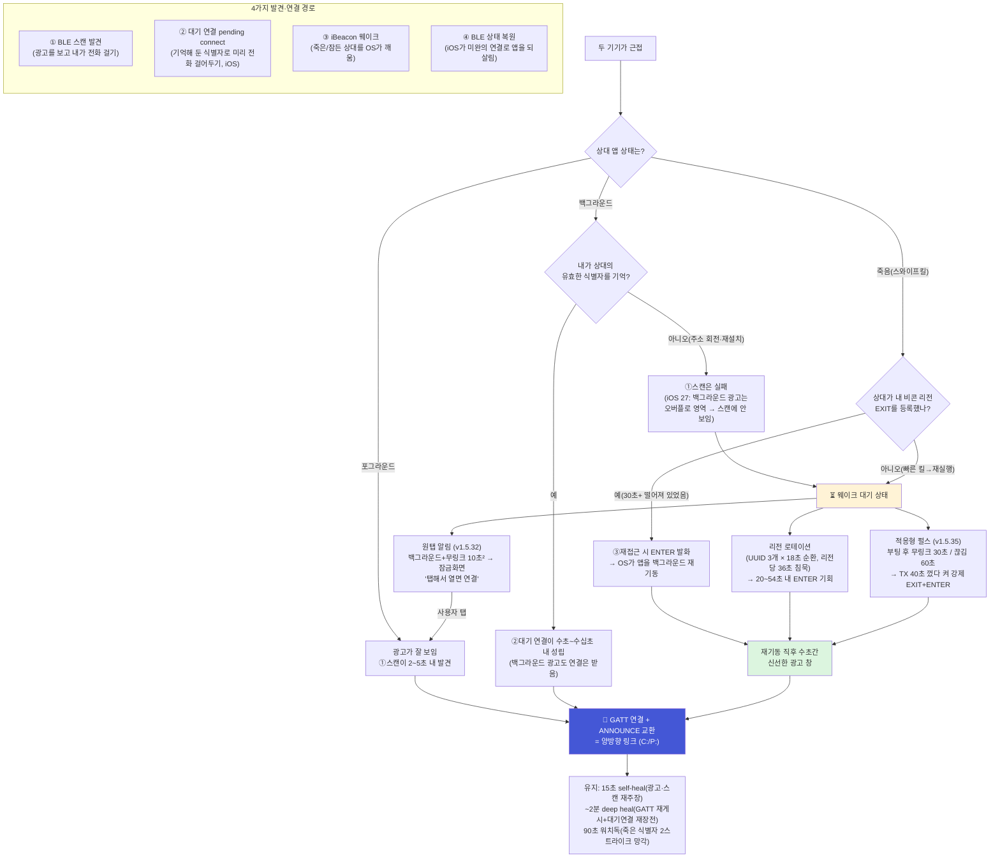
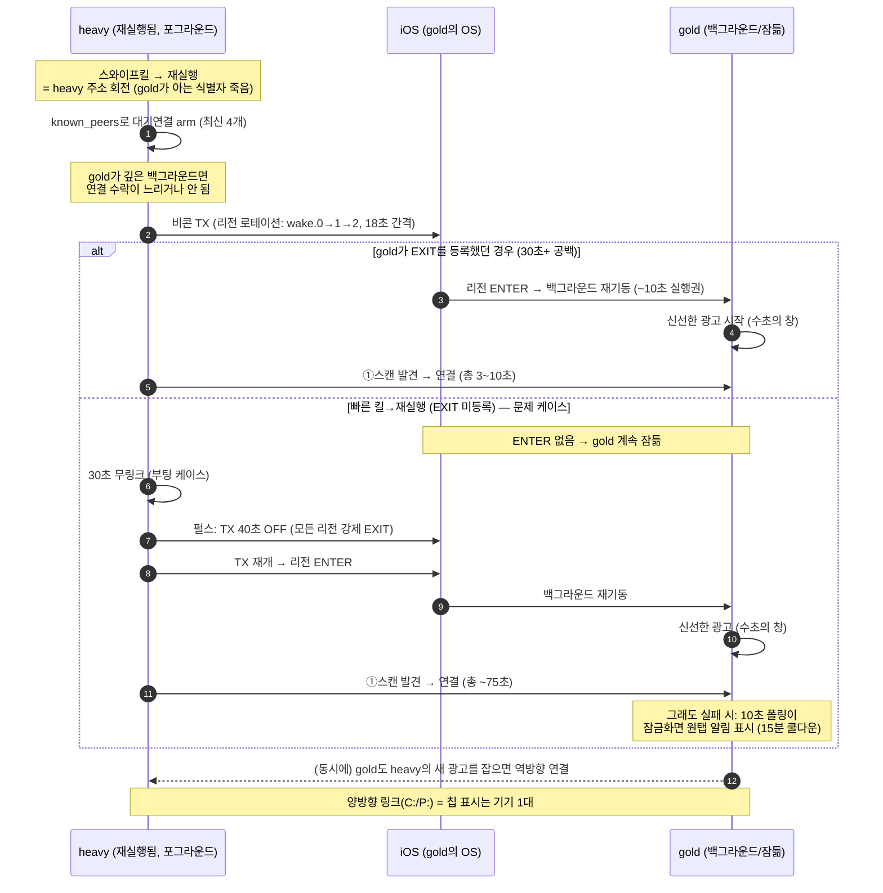

# SpotLink 상호 발견(Discovery) 로직 — 한눈에 보기

두 기기가 서로를 찾아 연결하는 경로는 **4갈래**이고, 상황(포그라운드/백그라운드/죽음)에 따라
쓸 수 있는 경로가 달라진다. 이 문서는 그 전체 지도와 대표 시나리오의 시간축을 담는다.
(코드 기준: v1.5.35 — `mesh_transport.dart`, `mesh_controller.dart`, `BeaconPlugin.swift/.kt`)

## 1. 전체 지도 — 상태별로 열리는 경로

핵심 비대칭 두 가지:
- **iOS 27은 백그라운드 iPhone을 스캔으로 못 본다** (오버플로 광고 + 필터 매칭 결함).
  그래서 백그라운드 상대에게는 ②대기연결(식별자)과 ③웨이크만이 유효하다.
- **스와이프킬/재실행은 BLE 주소(RPA)를 회전**시킨다. 상대가 기억한 내 식별자가 죽으므로,
  ②가 무력화되고 ③웨이크→신선한 광고 창→①스캔의 조합으로 복구한다.

## 2. 대표 시나리오 — "heavy 스와이프킬 → 재실행" 구조 (오늘 1분+ 지연의 주범)

## 3. 계층별 타이밍 요약

| 계층 | 주기/임계 | 역할 |
|---|---|---|
| iOS 포그라운드 스캔 교대 | 무필터 12초 ↔ 필터 6초 | 포그라운드 iPhone·Android 발견 ↔ 백그라운드 iPhone 발견(유일 경로) |
| Android 스캔 | 상시 무필터 + 적응 티어(low-latency/balanced/low-power) | 충전·배터리·링크 상태에 따라 자동 |
| 대기 연결(iOS) | 슬롯 4, 90초 워치독, 2스트라이크 망각 | 백그라운드 상대 재연결의 주 경로, 죽은 식별자 자가 청소 |
| 리전 로테이션 | UUID 3개 × 18초, 리전당 36초 침묵 | "리전 안에 갇힘" 없이 주기적 ENTER 기회 생성 |
| 적응형 펄스 (v1.5.35) | 부팅 무링크 30초 / 끊김 60초, 이후 60초 반복, 갭 40초 | 로테이션도 못 깨울 때 강제 EXIT+ENTER |
| self-heal | 15초 | 광고·스캔 재주장 (조용히 죽은 라디오 복구) |
| deep heal | 무링크 ~2분 | GATT 재게시 + 스테일 대기연결 취소 + 3초 후 재장전 |
| 원탭 알림 | 10초 폴링, 15분 쿨다운 | 자동 복구가 다 막혔을 때 사용자 구제 |
| 물리 하한 | 펄스 임계 + 40초(iOS EXIT 디바운스) + ~5초 | 본딩 없이는 이 아래로 단축 불가 |

## 4. 더 빠르고 안정적으로 — 갱신 포인트 (우선순위)

**전제: 순수 P2P — 재난 상황을 기준으로 Wi-Fi 공유기·LTE·인터넷이 전혀 없는 환경.**
이 전제에서 공유 네트워크가 필요한 후보(mDNS/LAN 발견, Mac LAN 릴레이, `LanSocketFastLane`)는 제외된다.
기기끼리 직접 만드는 링크(BLE, Wi-Fi Direct, AWDL/MultipeerConnectivity)만 유효하다.

| # | 갱신 | 효과 | 비용/리스크 |
|---|---|---|---|
| 1 | **QR 친구 한정 BLE 본딩** | 주소 회전 무력화 → 백그라운드에서도 **항상 수초 재연결**(②가 절대 안 죽음). 위 다이어그램의 "문제 케이스" 분기 자체가 소멸. 재난에서 가장 중요한 "손대지 않아도 계속 붙어 있음"의 근본책 | 페어링 팝업 UX, 본딩 불일치 복구(iOS는 앱이 못 지움), GATT 암호화 특성 도입 + 마이그레이션 |
| 2 | **Wi-Fi Direct / MPC를 발견·메시징까지 승격** | 라우터 없이 기기끼리 직접 Wi-Fi를 만든다(AP-less). BLE 대비 **가시선 2~4배 도달거리 + 수십 배 대역폭**. 지금은 파일 fast-lane에만 쓰이는 경로를 발견·일반 메시징에도 사용 | Android(Wi-Fi Direct) ↔ iOS(AWDL/MPC)는 상호 비호환 — **같은 플랫폼 클러스터끼리만** 직결되고, 플랫폼 간은 BLE가 다리 역할. 전력 소모 큼(발견 주기화 필요) |
| 3 | **L2CAP CoC 채널** | GATT notify 대비 파일 전송 수배 빠르고 배압 내장 — 재난 사진·지도 공유의 안정성 | iOS 11+/Android 10+ 한정, 채널 협상 로직 추가 |
| 4 | **멀티홉·store-and-forward 재난 튜닝** | 군중=노드 밀집이 재난의 조건. 릴레이 보관 수명·용량 상향, 긴급 메시지 우선순위, 재브로드캐스트 혼잡 제어로 **사람이 많을수록 잘 통하는** 특성 극대화 | 파라미터 튜닝 + 우선순위 플래그(프로토콜 소폭 확장) |
| 5 | **Android BLE Coded PHY(장거리 모드) + 확장 광고** | 지원 기기끼리 BLE 도달거리 **2~4배**(수백 m 가시선) — 수색·구조 시나리오에 직결 | Android 8+ 일부 기기 한정, iPhone은 미지원(Android↔Android 전용 보조 경로) |
| 6 | **재난 모드(초절전 프로파일)** | 충전 불가 전제: 스캔 듀티 대폭 축소 + 메시지 배칭으로 **수일 단위 생존** | 발견 지연 증가와의 트레이드오프(사용자 선택형) |

**권장 순서(재난·P2P 전제)**: 1번(본딩)이 단독 1순위 — 인프라 없는 환경에서 "항상 붙어 있음"을 만드는 유일한 근본책.
2번(Wi-Fi Direct/MPC 승격)이 거리·대역폭을, 3번(L2CAP)이 전송 품질을 올린다. 4번은 재난 특화 튜닝, 5·6번은 보조.
